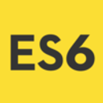

# React Light Boilerplate

A light and responsive boilerplate to build ReactJS applications that includes ReactJS 16, SASS, Webpack 4, Babel / Eslint, JEST and Enzyme.

## License

This project is licensed under the MIT License - see the [LICENSE.md](LICENSE.md) file for details
